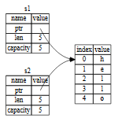
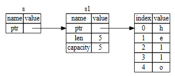

# 所有权测试（ownership_test）

## 1 所有权 ownership
- 定义：一组规则
- 用途：用于控制 rust 程序内存管理
- 方案：所有权系统和编译器检查
- 备注：所有权任何功能都不会减慢程序运行速度


## 2 堆（heap） 和 栈（stack）

### 存储方式
- 堆：叠盘子、后进先出
- 栈：餐厅吃饭、指针问路

### 分配速度
- 堆：直接压，分配更快
- 栈：找空间，簿记，为下一次分配做准备

### 访问速度
- 同上

### 使用时机
- 当代码调用函数时，传递给函数的值（可能包括指向堆上数据的指针）和函数的局部变量被推送到栈上。当函数结束时，这些值将从栈中弹出。
- 跟踪代码的哪些部分正在使用堆上的哪些数据，最大限度地减少堆上的重复数据量，以及清理堆上未使用的数据，这样就不会耗尽空间。


## 3 所有权规则

- 规则如下：
  1. Rust 中的每个值都有一个所有者。
  2. 一次只能有一位所有者。
  3. 当所有者超出范围时，该值将被删除。


## 4 作用域

- `{}`: 

```rust
    {                      // s is not valid here, it’s not yet declared
        let s = "hello";   // s is valid from this point forward

        // do stuff with s
    }                      // this scope is now over, and s is no longer valid

```


- `String`转移控制权：

```
    let s1 = String::from("hello");
    let s2 = s1;

```

- 图：变量 s2 在内存中的表示，它具有 s1 的指针、长度和容量的副本



- 采用 &String 而不是 String。这些＆符号代表引用，它们允许您引用某些值而不获取它的所有权。


- 更改引用无效：

```rust
// not work
fn main() {
    let s = String::from("hello");

    change(&s);
}

fn change(some_string: &String) {
    some_string.push_str(", world");
}
```

- 更改可变引用有效：

```rust
// it's working
fn main() {
    let mut s = String::from("hello");

    change(&mut s);
}

fn change(some_string: &mut String) {
    some_string.push_str(", world");
}
```

- 可变引用限定：
  - 不可多可变引用
  - 有不可变引用时，不可有可变引用

```rust
    let mut s = String::from("hello");

    let r1 = &s; // no problem
    let r2 = &s; // no problem
    let r3 = &mut s; // BIG PROBLEM

    println!("{}, {}, and {}", r1, r2, r3);

```
```
    let mut s = String::from("hello");

    let r1 = &s; // no problem
    let r2 = &s; // no problem
    println!("{} and {}", r1, r2);
    // variables r1 and r2 will not be used after this point

    let r3 = &mut s; // no problem
    println!("{}", r3);


```